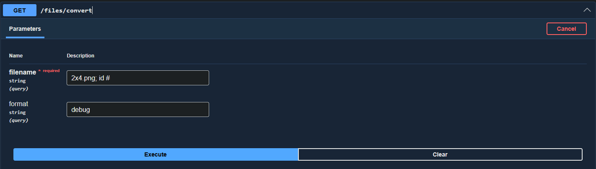
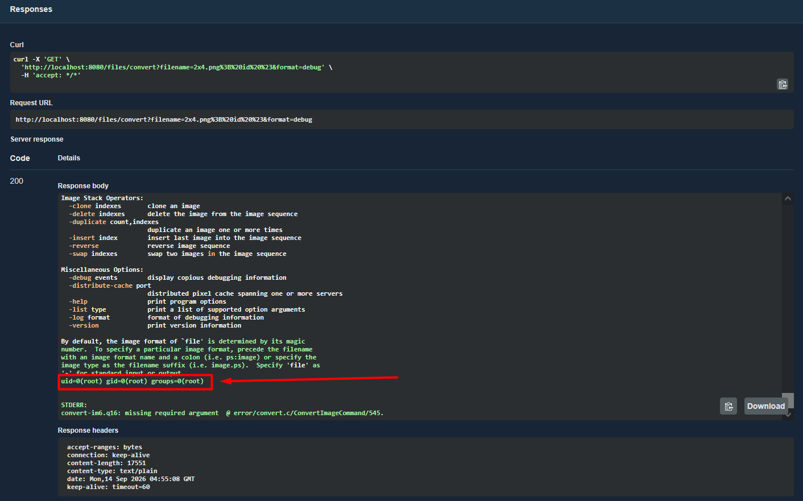
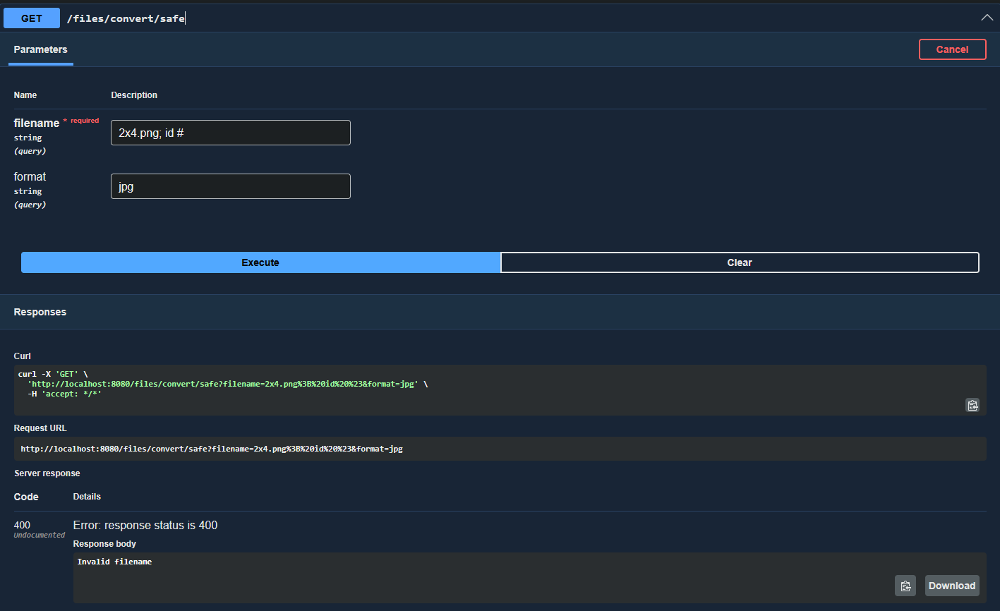
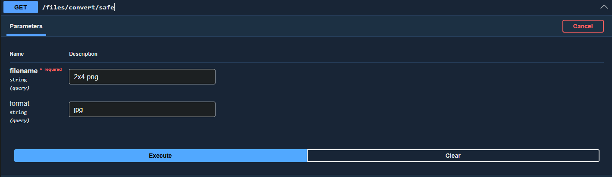
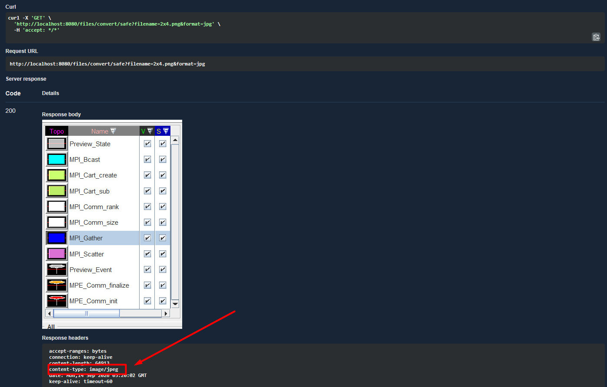

# Практика 1. Внедрение OS Command Injection уязвимости в демо-проект


>**Задача эндпоинта:** 
>> Конвертировать изображение, используя системную команду `convert`

## Решаем задачу в тупую

Возьмём имя нашего файла и соберём команду конкатенацией строк. А затем запустим её через ```bash```
```java
String inputPath = UPLOAD_DIR + "/" + filename;
String cmd = "convert " + inputPath + " " + format + ":-";
ProcessBuilder pb = new ProcessBuilder("/bin/sh", "-c", cmd);
```

> **Проблема**
>> В качестве названия файла, имеется возможность подставить любую команду, которая будет выполняться в ```bash```

### Использование уязвимости



По сути команда, которую мы выполнили в ```bash``` выглядит вот так
```bash
convert 2x4.png; id #debug:- 
```
Т.е. запускается 2 команды: ```convert``` и ```id```. А все аргументы, которые сервер пытается добавить в конец, для терминала выглядят как комментарий

Но ```convert``` сразу же падает, потому что он не получил ни имени выходного файла, ни формата, ни разрешения. В общем падает с недостатком данных
 
> P.S. Формат "debug" необходим, для отладочных целей. При другом формате, swagger будет выводить ответ в виде файла, что не удобно для анализа

## А теперь давайте исправлять косяк
Во-первых, добавим белые списки на название файла
```java
java.util.regex.Pattern SAFE_FILENAME = java.util.regex.Pattern.compile("^[A-Za-z0-9._-]+$");
if (!SAFE_FILENAME.matcher(filename).matches()) {
    return textError(400, "Invalid filename");
}
```
Это ограничит использование инъекций на уровне ввода.

Но может не избавить нас от них окончательно. 

Поэтому избавимся от сбора команды конкатенацией, а перейдём на сборку команды по параметрам
```java
List<String> command = List.of("convert", filePath.toString(), outSpec);
ProcessBuilder pb = new ProcessBuilder(command);
```
Неправильно собранная команда просто-напросто не запустится

Ну и на всякий случай, не забудем избавиться и от возможной path traversal
```java
Path filePath = Paths.get(UPLOAD_DIR).resolve(filename).normalize();
Path uploadDir = Paths.get(UPLOAD_DIR).toAbsolutePath().normalize();
if (!filePath.startsWith(uploadDir)) {
    return textError(400, "Invalid path");
}
```

А так же лишним не будет и проверка на формат куда конвертируем, чтобы злоумышленник не мог получить в качестве ответа что-нибудь этакое
```java
Set<String> ALLOWED_FORMATS = Set.of("png", "jpg", "jpeg", "gif", "webp");
String fmt = format.toLowerCase(Locale.ROOT);
if (!ALLOWED_FORMATS.contains(fmt)) {
    return textError(400, "Unsupported format: " + format);
}
```

### Демонстрация невозможности уязвимости


## Демонстрация работоспособности

